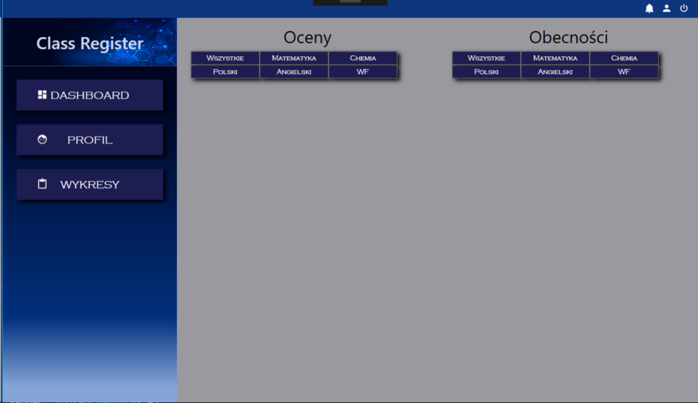

# <h1 id="opis">Class Register</h1>
Class Register to aplikacja stworzona na potrzeby projektu semestralnego z przedmiotu "Projektowanie obiektowe C#" przez <a href="tworcyS">trzy osoby</a>. 
Aplikacja ma na zadanie możliwość logowanie się do systemu jako uczeń lub nauczyciel (dwa różdne dashboardy i funkcjonalności dla tych dwóch typów użytkowników). 
Po zalogowaniu uczeń może przejrzeć swoje oceny i obecności w zakładce Dashboard, obejrzeć swoje dane w zakładce Profil i obejrzeć wykresy, które pomogą mu zobrazować sobie swoje oceny na tle klasy oraz swój postęp. 
Po zalogowaniu jako nauczyciel użytkownik ten może wprowadzać oceny i obecności na dany dzień swoim klasom w zakładce Dziennik, przejrzeć oceny i obecności uczniów dla innych dni w zakładce Klasy, obejrzeć swoje dane w zakładce Profil oraz obejrzeć wykresy. 

<h3 align="center"><a href="screeny"> >> Obejrzyj screeny aplikacji << </a></h3>

Nasza aplikacja została podpięta do bazy danych CRDB, która umożliwia dodawanie i wyświetlanie danych. 

 
## Użyte Technologie
* VisualStudio 2017 
* WPF 
* Entityframwork 
* Sqlite 

## Użyte biblioteki i frameworki:
[Entity Framework](https://github.com/aspnet/EntityFrameworkCore) 
[Live Charts](https://lvcharts.net/) 
[SQLite](https://github.com/mackyle/sqlite) 
[Material Design](https://github.com/MaterialDesignInXAML/MaterialDesignInXamlToolkit) 

<h1 id="screeny">Class Register Screeny</h1>

<h2 id="tworcy">Twórcy</h2>

* [Anna Gajda](https://github.com/Ojamenustik) 
* [Anna Gogól](https://github.com/anng96) 
* [Anna Bracha](https://github.com/silverdiamond45) 

