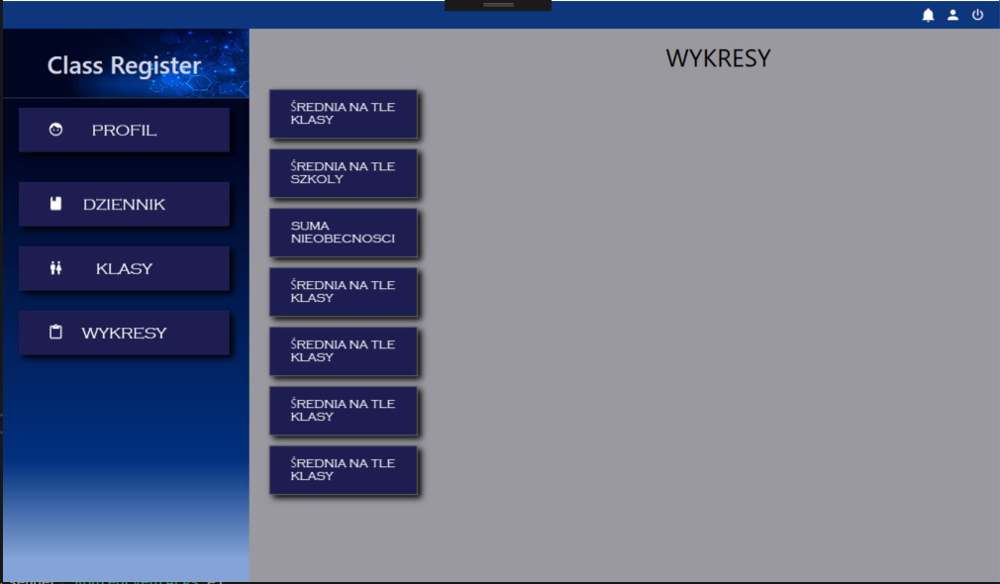
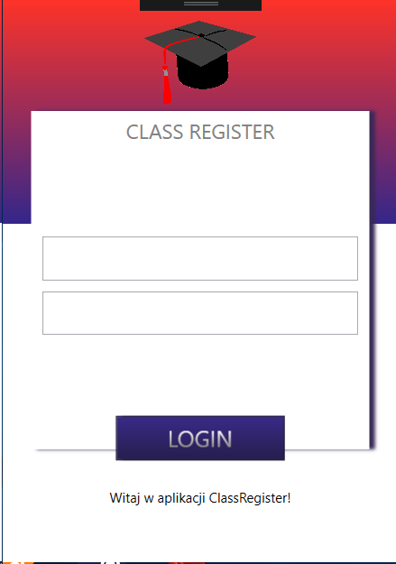
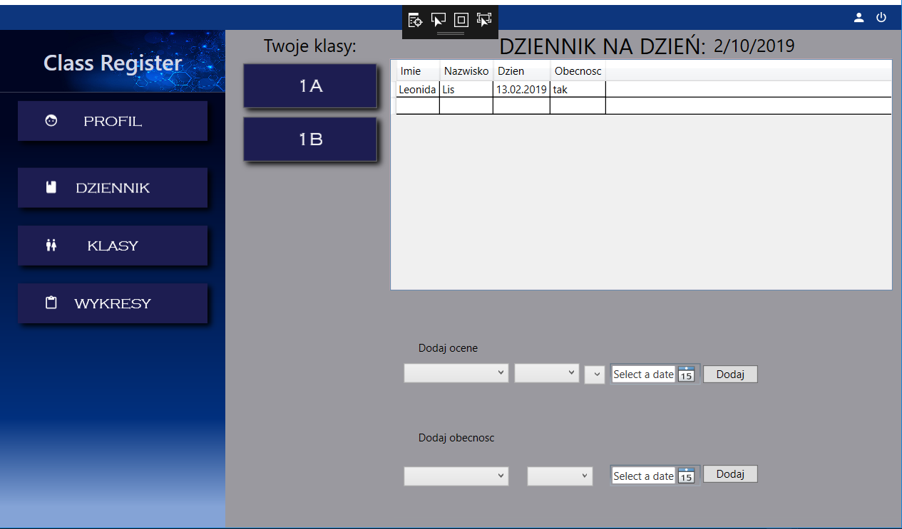
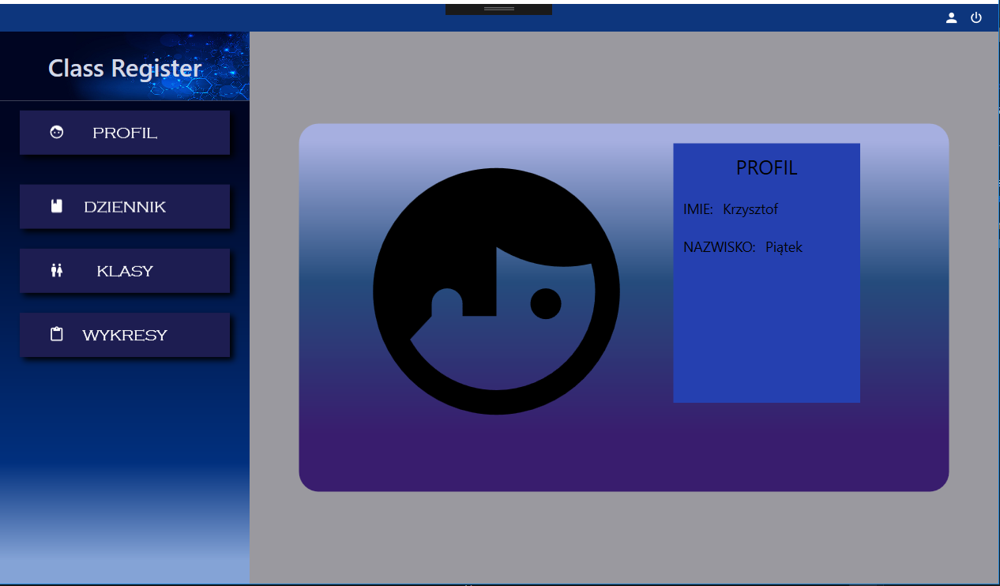
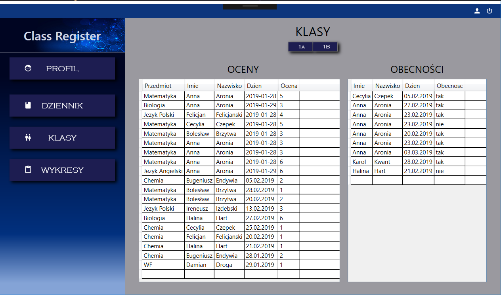

<h1 id="opis">Class Register</h1>
Class Register to aplikacja stworzona na potrzeby projektu semestralnego z przedmiotu "Projektowanie obiektowe C#" przez trzy osoby. 
Aplikacja ma na zadanie możliwość logowanie się do systemu jako uczeń lub nauczyciel (dwa różdne dashboardy i funkcjonalności dla tych dwóch typów użytkowników). 
Po zalogowaniu uczeń może przejrzeć swoje oceny i obecności w zakładce Dashboard, obejrzeć swoje dane w zakładce Profil i obejrzeć wykresy, które pomogą mu zobrazować sobie swoje oceny na tle klasy oraz swój postęp. 
Po zalogowaniu jako nauczyciel użytkownik ten może wprowadzać oceny i obecności swoim klasom w zakładce Dziennik, przejrzeć oceny i obecności uczniów w zakładce Klasy, obejrzeć swoje dane w zakładce Profil oraz obejrzeć wykresy. 

Nasza aplikacja została podpięta do bazy danych CRDB, która umożliwia dodawanie i wyświetlanie danych. 

 
## Użyte Technologie
* VisualStudio 2017 
* WPF 
* Entityframwork 
* Sqlite 

## Użyte biblioteki i frameworki:
[Entity Framework](https://github.com/aspnet/EntityFrameworkCore) 
[Live Charts](https://lvcharts.net/) 
[SQLite](https://github.com/mackyle/sqlite) 
[Material Design](https://github.com/MaterialDesignInXAML/MaterialDesignInXamlToolkit) 
[MSTest V2](https://github.com/Microsoft/testfx)

<h2 id="screeny">Class Register Screeny</h1>

<h3>Demo dostępy:</h3>
Login demo ucznia: u2
Hasło demo ucznia: u2
 
Login demo nauczyciela: user1
Hasło demo nauczyciela: user1

<h2>Twórcy</h2>

* [Anna Gajda](https://github.com/Ojamenustik) 
* [Anna Gogól](https://github.com/anng96) 
* [Anna Bracha](https://github.com/silverdiamond45) 

<h2>Pobierz aplikację!</h2>
<b></b>
